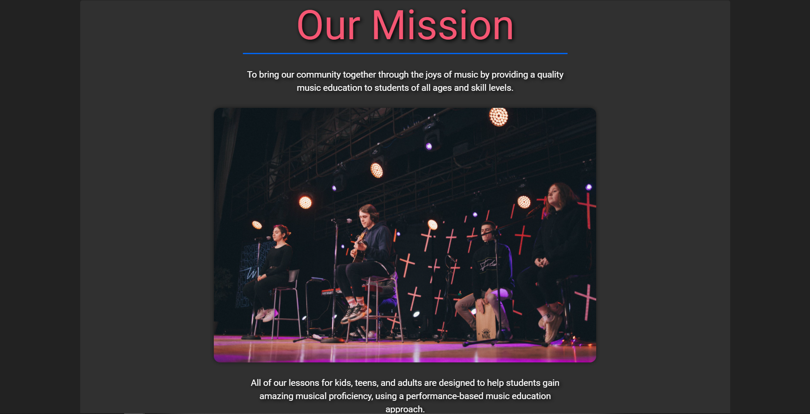
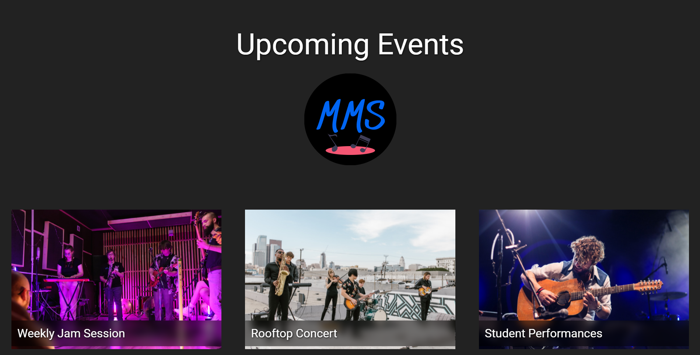
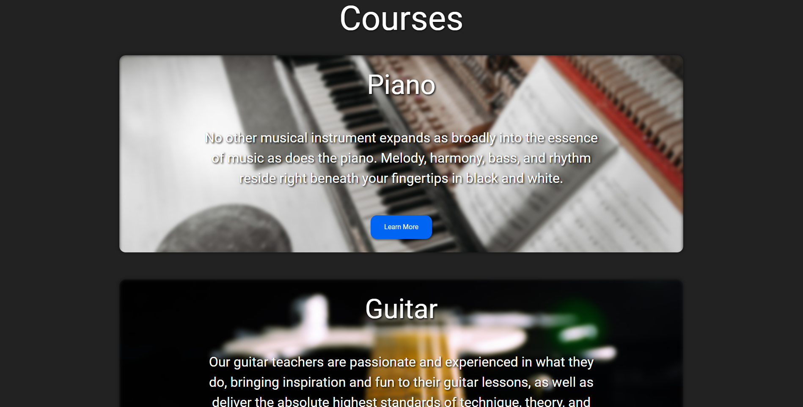
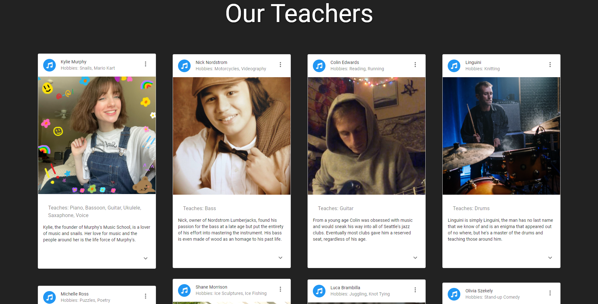
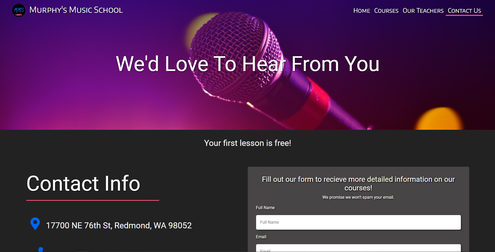
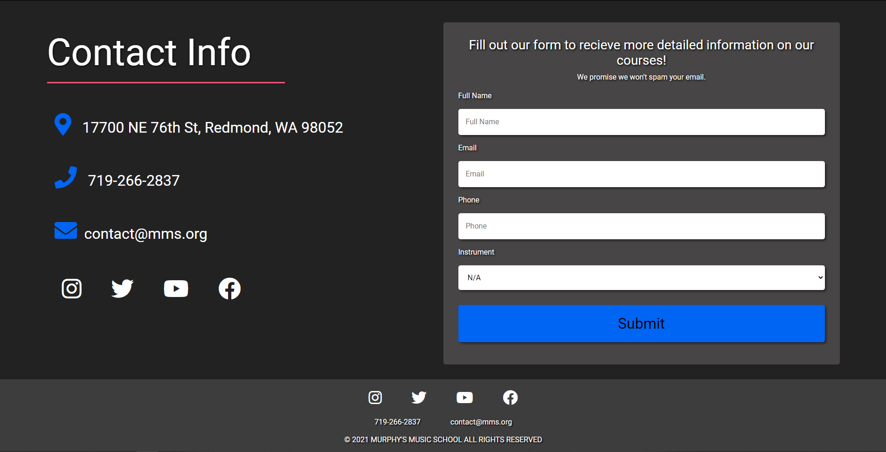

# Murphy's Music School

## Table Of Contents

- [Description](#description)
- [Deployed Application](###deployed-Application)
- [User Story](#user-Story)
- [Installation](#installation)
- [Screenshots](#screenshots)
- [Contributors](#contributors)

## Description

Murphy's Music School's mission is to bring their community together through the joys of music by providing a quality music education to students of all ages and skill levels. The school has paved a new pathway in the industry of music education by offering lessons from experienced musicians and incorporating a performance-based education approach. Meaning the curriculum focuses on learning music concepts and applying them in a live performance.

## Deployed-Application

https://colinjhedwards.github.io/murphy-music-school/

## User-Story

    As A music enthusiast,

    I WANT to be able to browse a music schools website to better understand if their lessons suit me,

    SO THAT I can learn how to play an instrument I am interested in.

## Installation

- https://github.com/ColinJhEdwards/murphy-music-school
- Cd into the correct folder and enter "npm i" to install necessary packages.
- Enter "npm start" to start the server.

## Screenshots

## Contributors

This app brought to you by:

- Colin Edwards https://github.com/ColinJhEdwards
